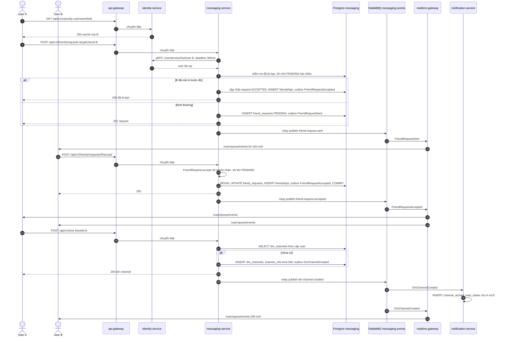

# Sequence: kết bạn và mở DM

File này mô tả gửi lời mời kết bạn (có gRPC sang Identity), chấp nhận, rồi mở DM (WF-07, FR-070..FR-075).

```mermaid
sequenceDiagram
    autonumber
    actor A as User A
    actor B as User B
    participant GW as api-gateway
    participant ID as identity-service
    participant MS as messaging-service
    participant MDB as Postgres messaging
    participant MQ as RabbitMQ messaging.events
    participant RT as realtime-gateway
    participant NT as notification-service

    A->>GW: GET /api/v1/users/by-username/bob
    GW->>ID: chuyển tiếp
    ID-->>A: 200 userId của B
    A->>GW: POST /api/v1/friends/requests targetUserId B
    GW->>MS: chuyển tiếp
    MS->>ID: gRPC UserService/GetUser B, deadline 300ms
    ID-->>MS: user tồn tại
    MS->>MDB: kiểm tra đã là bạn, lời mời PENDING hai chiều
    alt B đã mời A trước đó
        MS->>MDB: cập nhật request ACCEPTED, INSERT friendships, outbox FriendRequestAccepted
        MS-->>A: 200 đã là bạn
    else bình thường
        MS->>MDB: INSERT friend_requests PENDING, outbox FriendRequestSent
        MS-->>A: 201 request
    end
    MS->>MQ: relay publish friend-request.sent
    MQ->>RT: FriendRequestSent
    RT->>B: /user/queue/events lời mời mới

    B->>GW: POST /api/v1/friends/requests/R/accept
    GW->>MS: chuyển tiếp
    MS->>MS: FriendRequest.accept chỉ người nhận, chỉ khi PENDING
    MS->>MDB: BEGIN, UPDATE friend_requests, INSERT friendships, outbox FriendRequestAccepted, COMMIT
    MS-->>B: 200
    MS->>MQ: relay publish friend-request.accepted
    MQ->>RT: FriendRequestAccepted
    RT->>A: /user/queue/events
    RT->>B: /user/queue/events

    A->>GW: POST /api/v1/dms friendId B
    GW->>MS: chuyển tiếp
    MS->>MDB: SELECT dm_channels theo cặp user
    alt chưa có
        MS->>MDB: INSERT dm_channels, channel_refs kind DM, outbox DmChannelCreated
    end
    MS-->>A: 200 dm channel
    MS->>MQ: relay publish dm-channel.created
    MQ->>NT: DmChannelCreated
    NT->>NT: INSERT channel_activity, read_states cho A và B
    MQ->>RT: DmChannelCreated
    RT->>B: /user/queue/events DM mới
```
